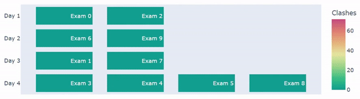

# Exam Timetabling

This app demonstrates how exam timetables can be optimised using D-Wave's Quantum annealers.

Given a list of exams being sit by each student, we try to schedule these exams across a specified number of time slots so that conflicting exams (i.e. exams with shared resources such as students, classrooms, etc.) are spread out as much as possible.

Here is an example showing a timetable of 10 exams over 4 days being optimised by the quantum computer, across 1000 reads:


## Usage

Make sure to install requirements in your own developer environment with:
```bash
pip install -r requirements.txt
``` 

To run the exam timetabler, run the command:

```bash
python exam_timetabler.py -f <filename> -s <solver>
```

The parameters ``filename`` refers to example problems that can be found in the **timetabling_problems** folder, and ``solver`` refers to the type of solver that is used to solve the problem, which can be found in **exam-timetabler.py**. If not specified, the program defaults to using D-Wave's Quantum Solver to solve the problem.

To view the visualisation, which optimises timetables using the Quantum Solver, run:

```bash
python app.py
```


## Code Overview

In `exam-timetabler.py`, we can use D-Wave's Quantum Annealing Solver to solve exam timetabling problems (examples of which are in folder **timetabling_problems**) with the following constraints:

1. Each exam has to be allocated exactly once.
2. Conflicting exams (exams with shared students) cannot be allocated to the same day.
3. Conflicting exams need to be spread out as much as possible (softer version of constraint 2).
4. **(Optional)** Sizes of exams allocated to a specific day has to be within the amount of classroom capacity of that day. 

### Example of Constraint 4
Exams being sat by 30 and 50 students in one day, cannot be allocated if there are 2 classrooms of sizes 40 and 40 available on that day. If classroom sizes were 40 and 50 however, they can be allocated and this constraint is satisfied.


## Code Specifics

The code in the `src` folder is called by `exam-timetabler.py` and has the following functionality:

* `preprocessor.py` takes the exam timetabling problem as input and returns the intermediate graphical representation of the problem.
* `bqm_builder.py` builds the [BQM](https://docs.ocean.dwavesys.com/en/stable/concepts/bqm.html) from the intermediate representation of the problem.
* `cqm_builder.py` builds the [CQM](https://docs.ocean.dwavesys.com/en/stable/concepts/cqm.html) from the intermediate representation of the problem (used only when calling Leap's Hybrid Solver).
* `timetable.py` provides validity checks for a Timetable object, which is created from results of a sampler.
* `utils.py` contains utility functions used to (1) write solutions to file and (2) calculate the conflict density of a problem.
* `visualisation.py` uses [Plotly](https://plotly.com/) to visualise samples returned from the annealing process.

There is also a [Dash](https://dash.plotly.com/) frontend for this application in `app.py`, which displays plots from `visualisation.py`.

<!-- ## References

A. Person, "Title of Amazing Information", [short link
name](https://example.com/) -->

## License

Released under the Apache License 2.0. See [LICENSE](LICENSE) file.
